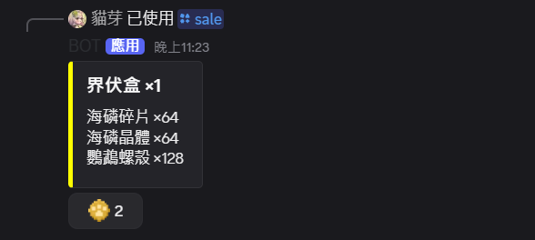

# 上架功能

## /sale [amount]

取代箱子商店的好方法!  

## 使用方法

在貓芽Discord群組內的[店面](https://discord.com/channels/1278590147193081947/1379683775562383420)或[地繪](https://discord.com/channels/1278590147193081947/1379684060565213316)，使用/sale將遊戲內手上的物品以[amount]價格上架到該頻道內  
買家可以透過點擊按鈕來購買商品  
賣家點擊按鈕會將物品下架  
當刊登在 Discord 的 /sale 被他人購買時會提示訊息和音效  

## 注意事項

1. 使用/sale上架商品需要月卡在有效期間，如果月卡過期商品不會消失(但後續無法再上架)
2. 買家必須遊戲內在線才能購買
3. 購買後，商品會直接放到背包內，放不下會丟在地上
4. 上述功能必須在[貓芽Discord群組](https://discord.gg/catbud)內先綁定帳號才能使用

## 更新紀錄

|版本|更新內容|
|:---:|:---:|
|r4-b67|月卡福利新增/sale|
|r4-b68|修復嚴重漏洞、顯示購買人資訊、賣家回收功能|
|r5-b22|修復「盾牌」沒有顯示其持有的「附魔」清單 「鍛造模板」沒有顯示「類型」|
|r5-b25|「配置」新增「Discord 商品售出通知」|
|r5-b26|「Discord 商品售出通知」顯示的物品名稱 會優先使用「鐵砧」更改的別名|
<!-- markdownlint-disable-file MD033 MD045-->  