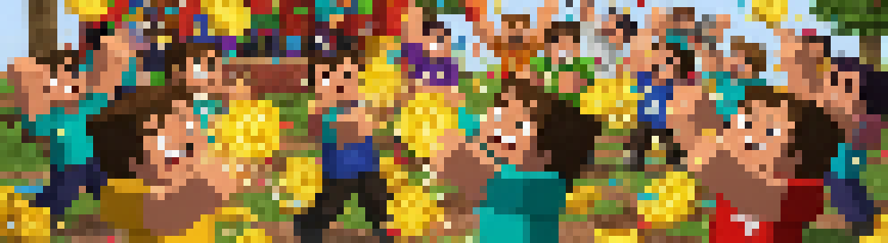

# 王者戰爭

少受傷去保護排位點數金幣，撐到結束時最多金幣的獲得 無限耐久x1 !

 王者以上才能參加  
 各隊伍隨機平均分配在3個分流中  
 冠軍獎品每個分流獨立發放一次  
 結束後會將所有資料恢復成參加前的狀態  
 最多4人同時參加  
 結算時若產生複數第一名則隨機抽選冠軍  
 僅在每月的最後一個禮拜日舉辦  
 金幣僅結算在個人而不是隊伍  

## 模式介紹

每個人會拿到與排位點數相關的金幣數量  
玩家在受到傷害會掉落 `(身上當前金幣數量的5%)+0~3` 個金幣  
每個人的金幣數量會實時顯示，當前持有最多金幣的玩家會發光  
結算時，身上持有最多金幣的人獲勝!

*獎勵會透過郵件發放

### 遊戲流程

觀察地形準備->倒數10分鐘->結算->解散

## 小研究

1. 結束時會廣播通知所有人冠軍是誰
2. 開始時間為晚上9:45
3. 虛空傷害不會爆金幣
4. 死亡不會噴裝，會重生在初始點
5. 期間登出伺服器累積20秒會自動棄權
6. 排位點數:金幣 = 5:1
7. 平均掉落金幣=0.025n + 0~3

## 更新紀錄

|版本|更新內容|
|:---:|:---:|
|r5-b26|新模式「王者戰爭」，進場要求暫時下修至  鐵牌而不是  王者|
|r5-b27|「王者戰爭」進場要求改回  王者|
|r5-b28|能撿起自己掉落的「金幣」 掉落的金幣從 1% 增加至 5%|
|r5-b30|「王者戰爭」會顯示所有人身上「金幣」的持有數量|
|r5-b32|「王者戰爭」新增敘述「金幣僅結算在個人而不是隊伍」|
|r5-b33|「王者戰爭」持有「金幣」最多的人將會發光|